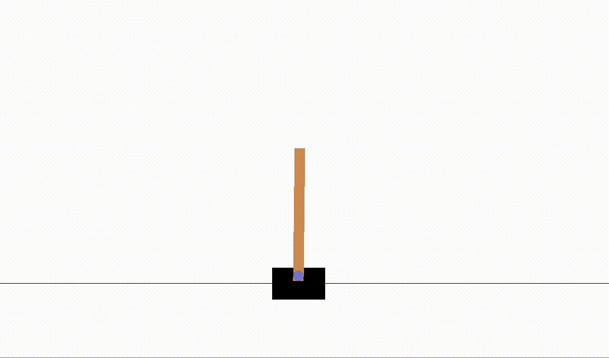

# Deep Q-Learning (Reinforcement Learning)

This Python Package can be used to train an agent to play various Atari Games ([OpenAI Gym](https://gym.openai.com/envs/#classic_control)) using [Deep Q-Learning](https://www.tensorflow.org/agents/tutorials/0_intro_rl).


## 📝 Table of Contents

- [Getting Started](#getting_started)
- [Agents](#agents)


## 🏁 Getting Started <a name = "getting_started"></a>

### Install all dependencies:
```
$ pip install -r requirements.txt
```
### Basic usage:
```
$ python -m dqn --agent <agent_name> --mode <train/simulate>
```

#### Parameters
  - `--agent`: Specify the agent to be used (Refer to [Agents](#agents)).
  - `--mode`: Train an agent (`train`) or simulate a trained agent (`simulate`).


## Agents <a name = "agents"></a>

### CartPole-v0 (`--agent cartpole`)
More information [here](https://gym.openai.com/envs/CartPole-v0/).

The following simulation is 3 episodes of a trained _CartPole_ agent receiving a mean reward of `200.0` after training for 1000 episodes.

<p align="center">

</p>

#### To Train:
```
$ python -m dqn --agent cartpole --mode train
```

#### To Simulate:
```
$ python -m dqn --agent cartpole --mode simulate
```

### Pong-V0 (`--agent pong`)
> In-progress
